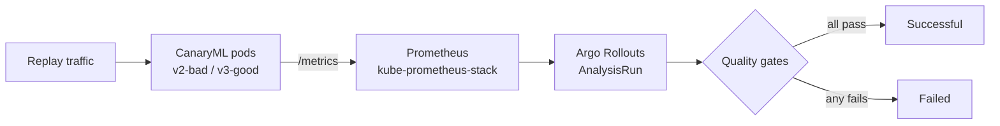

# CanaryML

**Metric-gated canary releases for ML models on Kubernetes, using Argo Rollouts and Prometheus.**

A new model version is released gradually, and measured data decides whether it is safe. Every revision is judged on three gates: **ML accuracy**, **HTTP 5xx error rate** and **p95 latency**. A model that is fast and error-free but inaccurate is still rejected.


## Result at a glance

| Revision | Pod-template hash | AnalysisRun | Verdict |
|---|---|---|---|
| Rev 15 (good model) | `b464b6c7` | `canaryml-b464b6c7-15-2` | **Successful**: all 3 metrics passed |
| Rev 16 (bad model) | `7666986765` | `canaryml-7666986765-16-5` | **Failed**: accuracy 0.3684 and 0.3810 against a required 0.85 |

The bad revision was quick (p95 ≈ 8.7 ms) and its error-rate gate passed, yet it was rejected on accuracy. Infrastructure metrics alone would have let it through.


## How it works



1. Replay requests with known true labels are sent to the CanaryML service.
2. The service counts correct and incorrect predictions (`model_predictions_total`) and records request counts and latency.
3. Prometheus scrapes these metrics.
4. Argo Rollouts creates an **AnalysisRun** per revision that queries Prometheus every 10 s (after a 30 s delay, 3 readings).
5. Each query is filtered by `rollouts_pod_template_hash`, so a verdict belongs to exactly one revision.
6. The AnalysisRun is `Failed` if any metric fails more than `failureLimit` (1) times.

## Quality gates

| Metric | Measures | Passes when | Fails when |
|---|---|---|---|
| `canary-accuracy` | correct ÷ total predictions, 2 min window | ≥ 0.85 | < 0.85 |
| `canary-error-rate` | 5xx requests ÷ all requests, 2 min window | < 0.02 | ≥ 0.02 |
| `canary-p95-latency` | 95th percentile request duration (s) | < 0.300 | ≥ 0.300 |

<details>
<summary>PromQL used by the AnalysisRun</summary>

```promql
# canary-accuracy
sum(increase(model_predictions_total{
      correct="true",
      rollouts_pod_template_hash="{{args.podTemplateHashValue}}"}[2m]))
/
sum(increase(model_predictions_total{
      rollouts_pod_template_hash="{{args.podTemplateHashValue}}"}[2m]))

# canary-error-rate
( sum(rate(http_requests_total{
      status=~"5..",
      rollouts_pod_template_hash="{{args.podTemplateHashValue}}"}[2m]))
  or vector(0) )
/
sum(rate(http_requests_total{
      rollouts_pod_template_hash="{{args.podTemplateHashValue}}"}[2m]))

# canary-p95-latency
histogram_quantile(0.95,
  sum by (le) (rate(http_request_duration_seconds_bucket{
      rollouts_pod_template_hash="{{args.podTemplateHashValue}}"}[2m])))
```
</details>

## Tech stack

| Component | Role |
|---|---|
| Kubernetes (kind) | Local cluster, namespace `canaryml` |
| Argo Rollouts | Canary strategy and AnalysisRuns |
| Prometheus (kube-prometheus-stack) | Stores and serves the metrics |
| CanaryML service | Serves the model, exposes prediction and request metrics |
| kubectl + PowerShell | Deploy, inspect, port-forward (Windows) |

## Evidence

Every claim is backed by a terminal screenshot in [`docs/evidence`](docs/evidence). The full write-up with captions, a claim-to-evidence table and appendices is in [`docs/CanaryML_Project_Execution_Document.docx`](docs/CanaryML_Project_Execution_Document.docx).

| ID | Shows | Revision |
|---|---|---|
| [E1](docs/evidence/E1.png) | Pods `1/1 Running`, Prometheus API check, port-forward | n/a |
| [E2](docs/evidence/E2.png) | Replay log with `v2-bad` and `v3-good` predictions | n/a |
| [E3](docs/evidence/E3.png) | Replay finished: 948 requests, 0 errors | n/a |
| [E4](docs/evidence/E4.png) | AnalysisRun identity and accuracy gate | 15 |
| [E5](docs/evidence/E5.png) | Accuracy PromQL and success condition | 15 |
| [E6](docs/evidence/E6.png) | p95 query and error-rate definition | 15 |
| [E7](docs/evidence/E7.png) | Error-rate readings (0, 0, 0) | 15 |
| [E8](docs/evidence/E8.png) | p95 readings (≈ 10.0, 9.75, 9.50 ms) | 15 |
| [E9](docs/evidence/E9.png) | Final status and events: **Successful** | 15 |
| [E10](docs/evidence/E10.png) | AnalysisRun identity and accuracy gate | 16 |
| [E11](docs/evidence/E11.png) | Queries and thresholds | 16 |
| [E12](docs/evidence/E12.png) | Error-rate and p95 definitions, completion time | 16 |
| [E13](docs/evidence/E13.png) | Accuracy 0.3684 / 0.3810 and the failure message | 16 |
| [E14](docs/evidence/E14.png) | p95 readings and run summary: **Failed** | 16 |
| [E15](docs/evidence/E15.png) | Events: `MetricFailed`, `AnalysisRunFailed` | 16 |
| [E16](docs/evidence/E16.png) | `kubectl get analysisrun` lists **Failed** | 16 |

### Key screenshots

**Bad model rejected (E13):** accuracy readings 0.3684 and 0.3810, below the 0.85 gate.


**Good model promoted (E9):** all metrics `Successful`, then `AnalysisRunSuccessful`.


## Inspect it yourself

```powershell
# cluster state
.\bin\kubectl.exe get pods -n canaryml -o wide

# list and inspect AnalysisRuns
.\bin\kubectl.exe get analysisrun -n canaryml
.\bin\kubectl.exe describe analysisrun <analysisrun-name> -n canaryml

# expose a CanaryML pod for replay traffic
.\bin\kubectl.exe port-forward -n canaryml pod/<canary-pod> 8001:8000

# check Prometheus (after port-forwarding it on 9090)
curl.exe "http://localhost:9090/api/v1/query?query=model_predictions_total"
```

## Limitations

These are not visible in the current screenshots:

- The canary traffic weights and steps.
- The rollout state after the failed analysis (for example Aborted).
- Which ReplicaSet served `v2-bad` versus `v3-good`.
- The later accuracy readings for Rev 15 and the error-rate readings for Rev 16 (cut off in the captures).

Capture them with `kubectl get rollout canaryml -n canaryml -o yaml` and `kubectl argo rollouts get rollout canaryml -n canaryml`.

## Repository layout

```
.
├── README.md
└── docs/
    ├── CanaryML_Project_Execution_Document.docx   # full evidence document
    ├── evidence/                                  # E1–E16 terminal screenshots
    └── figures/                                   # architecture and results charts
```

Add your manifests and service code alongside `docs/` and list them here.

## Author

Amodh
